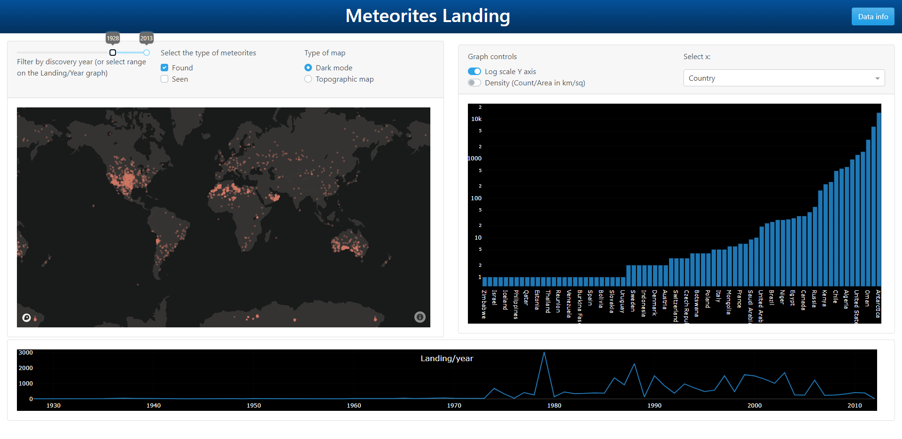

# Meteorites_visualization
meteorites visualization dashboard

The data are the meteorites landing data coming from the NASA open data: https://data.nasa.gov/Space-Science/Meteorite-Landings/gh4g-9sfh

In this repos you will find the notebooks I used for the visualization and the dash app.

The dashboard is deployed here: https://meteorite-lb.herokuapp.com/ (no longuer running due to stop of the free plans)

